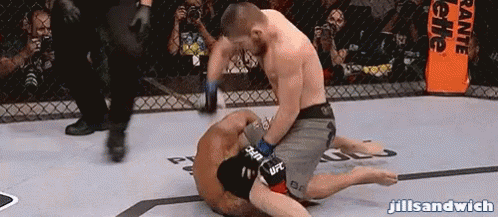

## Abdullah Khanani's Page
About Me 
## Things I Like
- Cars
- Wrestling & MMA
- Aviation
- Shoes
- Video Games
- Music
- Basketball

## Issues I Faced
- At first, everything was normal and the setups were great. Once I wanted to run some commands, I was hit with my first major issue, which was that my computer woudn't detect python. I was stuck on this issue for a while as I couldn't figure out where the source of the problem was. 

- After solving that issue, I had issues with the make command as vscode    would not let me run this command. After getting some help from the helpers, I realized that one of my commands had python instead of python 3. This was an obstacle that I didn't realize. After replacing the command, my make command was fixed and was running perfectly.

## Here's a Quick Game Break
That was a lot of reading! Here's a quick round of INVISIBLE snake!

<body>
<canvas width="400" height="400" id="game"></canvas>

</body>

<html lang="en">
<head>
    <meta charset="UTF-8">
    <meta name="viewport" content="width=device-width, initial-scale=1.0">
    <title>Your Quiz Page</title>
    <!-- Add any additional head elements if needed -->
</head>
<body>

    <!-- Heading to display quiz status -->
    <h2 id="quiz_status">Question 1 of 4</h2>

    <!-- Div to contain the quiz questions and options -->
    

        <!-- Add your quiz questions and options here -->
        
Question 1: What is your favorite color?

        <label for="option1">Red</label>
        <input type="radio" name="question1" id="option1" value="option1">
        <label for="option2">Blue</label>
        <input type="radio" name="question1" id="option2" value="option2">
        <!-- Repeat similar structure for other questions -->

        <!-- Button to submit responses to each question -->
        <button id="submit_button" onclick="submitResponse()">Submit</button>
    

    <!-- Add any additional body content if needed -->

    <!-- JavaScript or other scripts if required -->

</body>
</html>
